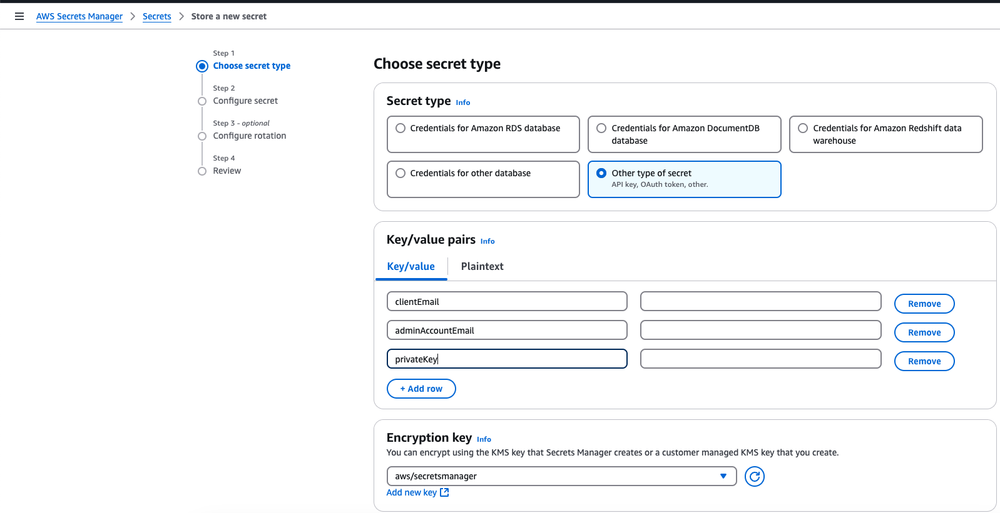
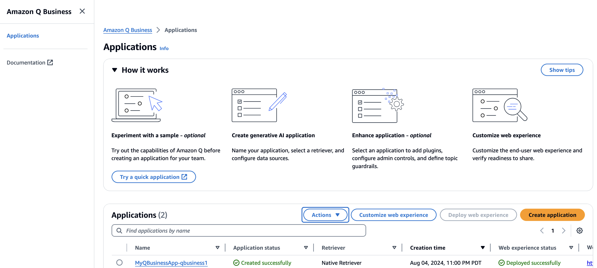
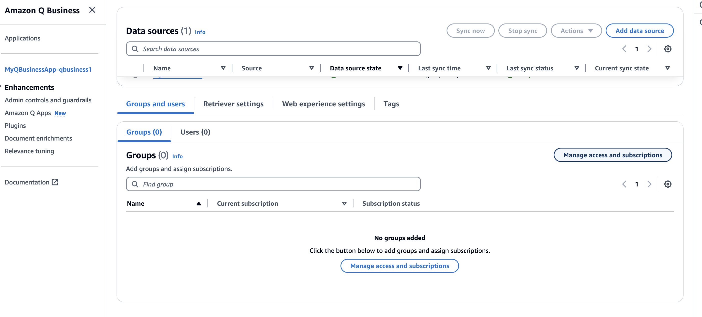
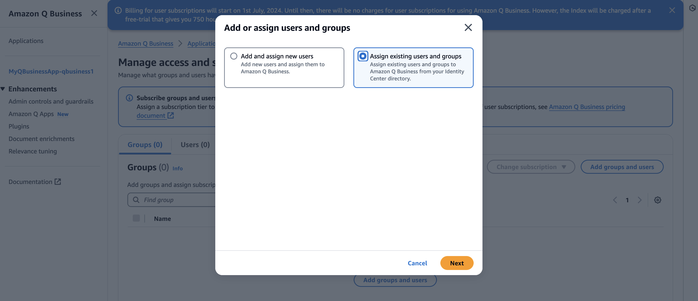
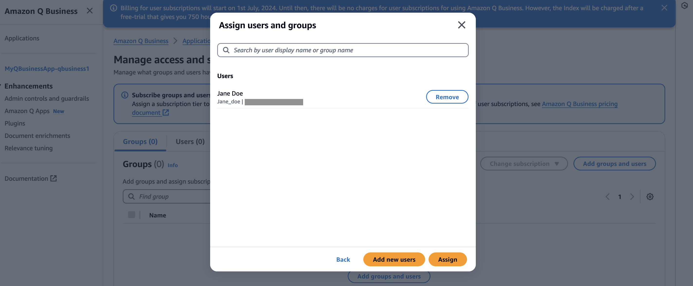
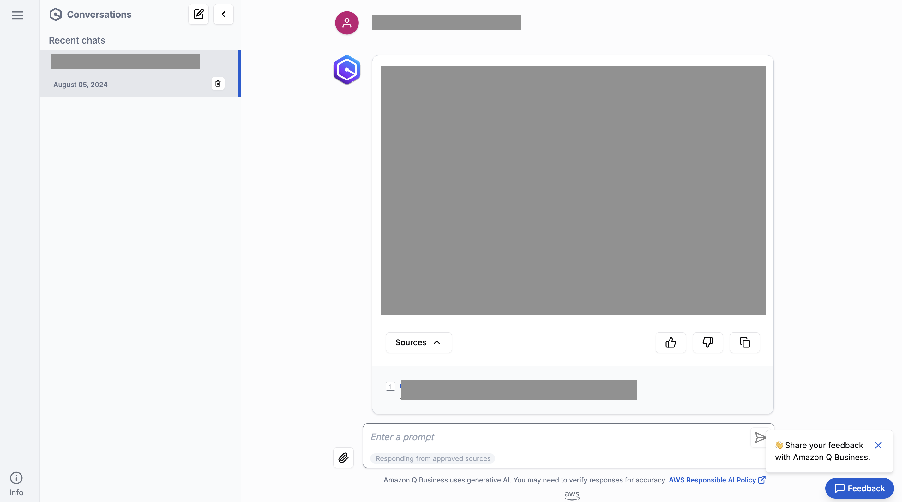

# Amazon Q Business to Amazon Simple Storage Service (Amazon S3)

This pattern contains a sample AWS SAM stack that leverages Amazon Q Business to build a generative AI application to derive insights from content present in a Google Drive account. An AWS Lambda function initiates the crawling and indexing of the documents present in the specified Google Drive repository. Users can then ask questions to the Amazon Q Business application to receive a generated response. 

Important: this application uses various AWS services and there are costs associated with these services after the Free Tier usage - please see the AWS Pricing page for details. You are responsible for any AWS costs incurred. No warranty is implied in this example.

## Requirements
* [Create an AWS account](https://portal.aws.amazon.com/gp/aws/developer/registration/index.html) if you do not already have one and log in. The IAM user that you use must have sufficient permissions to make necessary AWS service calls and manage AWS resources.
* [AWS CLI](https://docs.aws.amazon.com/cli/latest/userguide/install-cliv2.html) installed and configured
* [Git Installed](https://git-scm.com/book/en/v2/Getting-Started-Installing-Git)
* [AWS Serverless Application Model](https://docs.aws.amazon.com/serverless-application-model/latest/developerguide/serverless-sam-cli-install.html) (AWS SAM) installed
* [Enable AWS IAM Identity Center](https://docs.aws.amazon.com/singlesignon/latest/userguide/get-set-up-for-idc.html)
* [Create Users in AWS IAM Identity Center](https://docs.aws.amazon.com/singlesignon/latest/userguide/addusers.html). Note down the Instance ARN by going to the AWS IAM Identity Center console --> Settings --> Instance ARN. You will require it when deploying the stack. 
* [Create a Secret in AWS Secrets Manager](https://docs.aws.amazon.com/secretsmanager/latest/userguide/create_secret.html). Make sure to select "Other type of secret" and enter the below keys, with their corresponding values from your Google Drive Service Account connection credentials (more information regarding the preparation of this information can be found [here](https://docs.aws.amazon.com/amazonq/latest/qbusiness-ug/google-prereqs.html)). 



* Note down the Secret ARN by going to the AWS Secrets Manager console --> Secrets --> Your secret name. You will require it when deploying the stack. 


## Deployment Instructions
1. Create a new directory, navigate to that directory in a terminal and clone the GitHub repository:
    ```
    git clone https://github.com/aws-samples/serverless-patterns
    ```
1. Change directory to the pattern directory:
    ```
    cd qbusiness-google-drive-lambda
    ```
1. From the command line, use AWS SAM to deploy the AWS resources for the pattern as specified in the template.yml file:
    ```
    sam deploy --guided --capabilities CAPABILITY_NAMED_IAM
    ```
1. During the prompts:

    * Enter a stack name.
    * Enter the desired AWS Region.
    * Enter the S3 bucket name containing the contents you want to crawl. 
    * Enter the AWS IAM Identity Center Instance ARN noted from the instructions followed in Requirements.
    * Allow SAM CLI to create IAM roles with the required permissions.

    Once you have run `sam deploy --guided` mode once and saved arguments to a configuration file (samconfig.toml), you can use `sam deploy` in future to use these defaults.*

1. Note the outputs from the SAM deployment process. These contain the resource names and/or ARNs which are used for testing.

# How it works
Please refer to the architecture diagram below:


Here's a breakdown of the steps:

**Amazon Q Business Application:** Amazon Q Business application created with Google Drive as the data source. 

**Google Drive:** The Google Drive repository that contains data to be indexed.

**AWS Lambda:**  AWS Lambda function `DataSourceSync` crawls and indexes the content from the Google Drive repository. The Amazon Q Business application retrieves data from the indexed content and provides a generated response.

## Testing

1. Go to the Amazon Q Business Console and verify that your application `MyQBusinessApp-${StackName}` has been created.
    

1. Click on the Name of the Application. Scroll down to the `Groups and Users` section. Click on `Manage access and Subscriptions`.
    
1. Click on `Add groups and users` and select `Assign existing users and groups`. Click `Next`. 

    Note: If you have NOT already created a user in the Requirements section, then create one by choosing `Add and assign new users` instead and add the user. 
    
1. Add the name of the user and click on `Assign`.
    
1. Select the user and in the `Change subscription` dropdown, select `Update subscription tier`. In the `New subscription` dropdown, choose `Q Business Lite` and `Confirm`.
    
1. Go back to your application. Under `Web experience settings`, copy the `Deployed URL` link.
    
1. Open the URL in a New Incognito Window. Login to the web experience with the credentials of the created user. Ask a question in the chat interface regarding the documents you have in the Google Drive account you have provided as a data source.
    

## Cleanup

1. Delete the stack
    ```bash
    sam delete
    ```
----
Copyright 2023 Amazon.com, Inc. or its affiliates. All Rights Reserved.

SPDX-License-Identifier: MIT-0
